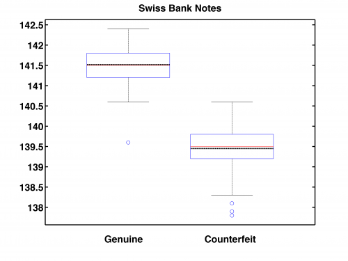
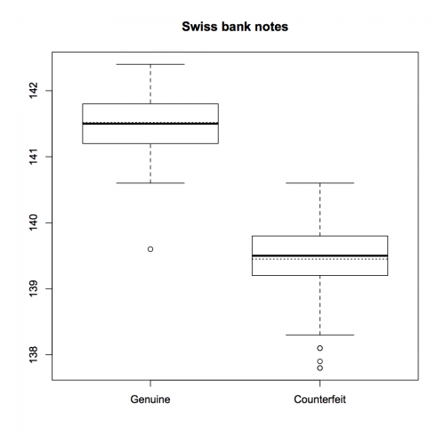

[](http://quantlet.de/)

## [](http://quantlet.de/) **SMSboxbank6** [](http://quantlet.de/)

```yaml

Name of Quantlet: SMSboxbank6

Published in: Multivariate Statistics: Exercises and Solutions Series 

Description: 'It produces boxplots of samples of genuine and counterfeit Swiss bank notes. The boxplots are made for the length of the diagonal (variable x6). Evidently, the genuine bank notes have larger diagonal length, seem to be more symmetric as the median (solid line) and mean (dashed line) are almost overlapping, and the distribution of the genuine bank notes is more narrow that the counterfeit. There are no outliers.'

Keywords:    boxplot, data visualization, five number summary, graphical representation, mean, median, plot, robust estimation, visualization

See also: SMSandcurpopu, SMSboxbank6, SMSboxcar, SMSboxunemp, SMSdenbank, SMSdrafcar, SMSfacenorm, SMShiscar, SMShisheights, SMSpcpcar, SMSscanorm2, SMSscanorm3, SMSscapopu

Author[m]:   Awdesch Melzer
Author[r]:   Jaroslav Pazdera

Submitted:  Fri, August 07 2015 by Awdesch Melzer

Datafile[r]: bank2.rda
Datafile[m]: bank2.dat

Example: Boxplots of samples of genuine and counterfeit Swiss bank notes

```





### MATLAB Code
```matlab

clear all                     % clear variables
close all                     % close windows
clc                           % blank page

load bank2.dat                % load data

mu1 = mean(bank2(1:100,6));   % compute means for each group
mu2 = mean(bank2(101:200,6));

hold on                       % start plot by putting lines for mean
line([0.6 1.4],[mu1 mu1],'Color','k','LineStyle','--','LineWidth',2) % mean Genuine
line([1.6 2.4],[mu2 mu2],'Color','k','LineStyle','--','LineWidth',2) % mean Counterfeit
boxplot([bank2(1:100,6) bank2(101:200,6)],'Symbol','o','widths',0.8) % add boxplot
set(gca,'XTickLabel',{''},'FontSize',16,'FontWeight','Bold')         % clear x-axis ticks
title('Swiss Bank Notes','FontSize',16,'FontWeight','Bold')          % set title
xlabel(['Genuine                       Counterfeit'],'FontSize',16,'FontWeight','Bold')
box on
set(gca,'LineWidth',1.6,'FontSize',16,'FontWeight','Bold')           % set frame
hold off

% to save plot please uncomment following lines 
% print -painters -dpng -r600 SMSboxbank6.png
% print -painters -dpdf -r600 SMSboxbank6.pdf
```

automatically created on 2018-05-28

### R Code
```r

graphics.off()                                                       # close windows
rm(list=ls(all=TRUE))                                                # clear variable list

# setwd("C:/...")        
load("bank2.rda")                                                    # load data
d     = data.frame(diagon=bank2[,6],kateg=rep(1:2,each=100))         # set data frame
d[,2] = factor(d[,2], levels=1:2, labels=c("Genuine","Counterfeit")) # set groups
boxplot(diagon~kateg,main="Swiss bank notes",data=d)                 # boxplot of diagonal of banknotes for both types of bank notes
```

automatically created on 2018-05-28